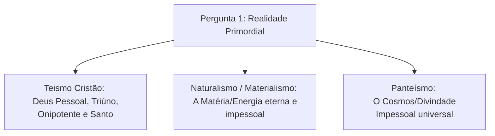

# Capítulo 02: As Sete Perguntas Fundamentais (Parte 1)

James Sire explica que o mapa de qualquer cosmovisão pode ser diagnosticado a partir das respostas dadas a **sete perguntas fundamentais**. Neste capítulo, examinamos as quatro primeiras perguntas, que tratam da Realidade, do Cosmos, do Homem e da Morte.

---

## ❓ 1. Qual é a Realidade Primordial? *(O que é realmente verdadeiro?)*

Esta é a pergunta metafísica suprema. A resposta dada aqui determina todo o resto do sistema de pensamento:

* **Cosmovisão Cristã**: A realidade primordial é **Deus** — Pessoal, Eterno, Triúno, Onisciente, Onipotente e supremamente Bom.
* **Naturalismo**: A realidade primordial é o **Cosmo Material** ou a energia física existente por si mesma.
* **Panteísmo Oriental**: A realidade primordial é uma substância espiritual impessoal (ex: *Brahman*).

---

## ❓ 2. Qual é a Natureza da Realidade Externa? *(O mundo ao nosso redor)*

Esta pergunta analisa como enxergamos a estrutura do universo físico e invisível:

* **Criado vs. Autônomo**: O mundo foi criado *ex nihilo* por Deus ou existe de forma autônoma e autossuficiente?
* **Ordenado vs. Caótico**: O universo opera sob leis inteligíveis e propósitos divinos ou sob acidentes caóticos e forças cegas da natureza?
* **Matéria vs. Espírito**: A realidade se resume aos átomos e forças físicas observáveis, ou inclui uma dimensão espiritual objetiva criada por Deus?

---

## ❓ 3. O que é um Ser Humano?

A antropologia filosófica depende inteiramente da visão sobre o Criador:

| Cosmovisão | Definição do Ser Humano |
| :--- | :--- |
| **Teísmo Cristão** | Uma pessoa criada à **Imagem e Semelhança de Deus** (*Imago Dei*), dotada de dignidade moral, razão e destino eterno, embora afetada pela Queda. |
| **Materialismo / Naturalismo** | Uma **máquina biológica complexa** ou um "gorila nu" resultante de processos evolutivos não-guiados. |
| **Panteísmo / Nova Era** | Um "deus adormecido" que precisa despertar para a sua própria divindade essencial. |
| **Pós-Modernismo** | Um produto social e linguístico desprovido de essência fixa ou propósito transcendente. |

---

## ❓ 4. O que Acontece Quando uma Pessoa Morre?

A resposta ao problema da morte reflete a esperança e o destino final da vida humana:

1. **Teísmo Cristão**: A morte física não é o fim da existência. Há o Julgamento Divino, a ressurreição dos mortos e o destino eterno (comunhão com Deus ou separação eterna).
2. **Naturalismo / Ateliê**: **Extinção Pessoal Completa**. A consciência cessa definitivamente com a morte cerebral.
3. **Panteísmo**: **Reencarnação** contínua (*Samsara*) até a absorção final da individualidade na Consciência Universal.
4. **Espiritualismo / Existencialismo**: Transformação em um estado elevado ou passagem para uma dimensão espiritual obscura.

---

### Links dos Capítulos:
- ⬅️ [Capítulo 01: Definição e Natureza de uma Cosmovisão](file:///f:/ESTUDOS_BIBLICOS/COSMOVISAO_JAMES_SIRE/01_Definicao_e_Natureza_de_uma_Cosmovisao.md)
- ➡️ [Capítulo 03: As Sete Perguntas Fundamentais (Parte 2)](file:///f:/ESTUDOS_BIBLICOS/COSMOVISAO_JAMES_SIRE/03_As_Sete_Perguntas_Fundamentais_Parte_2.md)
