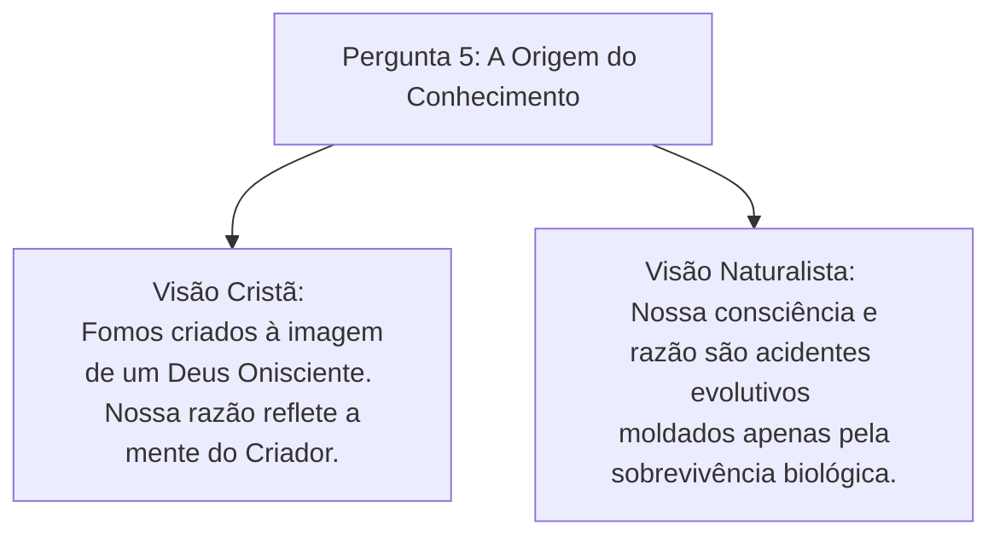

# Capítulo 03: As Sete Perguntas Fundamentais (Parte 2)

Neste capítulo, abordamos as três últimas perguntas diagnósticas formuladas por James W. Sire, que investigam o Conhecimento (Epistemologia), a Moralidade (Ética) e o Significado do Tempo (Teleologia/História).

---

## ❓ 5. Por que é Possível Conhecer alguma Coisa? *(Epistemologia)*

Esta pergunta investiga a validade da razão e da ciência humana:

### A Fundamentação Cristã do Conhecimento
Para a Cosmovisão Cristã, o conhecimento verdadeiro é possível porque:
* Deus é a Verdade e a Fonte de todo a sabedoria;
* O homem foi dotado de capacidades cognitivas (*Imago Dei*) projetadas por Deus para apreender a realidade do mundo criado e da Revelação Divina;
* Há uma correspondência direta entre a mente humana e a ordem racional do universo criado.

### O Dilema do Naturalismo
Se a mente humana é apenas o resultado não-guiado de mutações genéticas cegas voltadas unicamente para a sobrevivência biológica (e não para a busca da verdade objetiva), **por que deveríamos confiar na capacidade da mente humana de produzir teorias científicas ou filosóficas verdadeiras?**

---

## ❓ 6. Como Sabemos o que é Certo e Errado? *(Ética)*

A questão ética investiga a origem dos padrões morais universais:

* **Cosmovisão Cristã**: O certo e o errado estão ancorados no **Caráter Santo e Imutável de Deus**. A lei moral expressa a natureza justa do Criador e é revelada na Escritura e na consciência humana (Romanos 2:14-15).
* **Relativismo Cultural / Sociológico**: O certo e o errado são meras convenções sociais criadas por grupos humanos para manter a ordem ou o poder.
* **Emotivismo / Subjetivismo**: Moralidade é apenas uma questão de sentimento pessoal ("é certo o que me faz sentir bem").
* **Evolucionismo Social**: Padrões morais são comportamentos adaptativos que favoreceram a preservação da espécie.

---

## ❓ 7. Qual é o Significado da História Humana? *(Teleologia)*

A história humana é um processo com propósito ou uma sucessão de eventos aleatórios?

| Cosmovisão | Compreensão da História |
| :--- | :--- |
| **Teísmo Cristão** | **Linear e Redentora**: A história tem começo, meio e fim (Criação, Queda, Redenção em Cristo e Consumação). É governada pela Providência de Deus em direção à Sua glória final. |
| **Naturalismo** | **Processo Cego**: Uma sequência de eventos físicos sem direção moral, meta transcendente ou significado intrínseco. |
| **Panteísmo Oriental** | **Cíclica**: Uma roda interminável de eras, nascimentos e reencarnações (*Yugas*) sem ponto final de consumação. |
| **Utopismo Secular** | **Progresso Humano**: A ilusão de que a ciência e a política humana construirão um paraíso perfeito na Terra. |

---

### Links dos Capítulos:
- ⬅️ [Capítulo 02: As Sete Perguntas Fundamentais (Parte 1)](file:///f:/ESTUDOS_BIBLICOS/COSMOVISAO_JAMES_SIRE/02_As_Sete_Perguntas_Fundamentais_Parte_1.md)
- ➡️ [Capítulo 04: Pluralismo, a Ilusão da Neutralidade e a Vida Examinada](file:///f:/ESTUDOS_BIBLICOS/COSMOVISAO_JAMES_SIRE/04_Pluralismo_Ingenuidade_e_a_Inevitabilidade_da_Cosmovisao.md)
