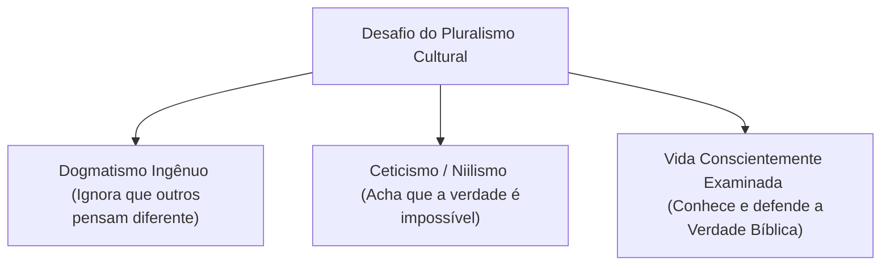

# Capítulo 04: Pluralismo, a Ilusão da Neutralidade e a Vida Examinada

## 1. Viver em um Mundo Pluralista

Quando expostas em sequência, as sete perguntas fundamentais de uma cosmovisão podem provocar duas reações opostas:

1. **Achar as respostas óbvias demais**: A pessoa pensa: *"Por que alguém perderia tempo fazendo perguntas com respostas tão evidentes?"*
2. **Sentir-se incapaz de responder**: A pessoa conclui que nenhuma certeza é possível.

James Sire alerta que achar as respostas da sua própria cosmovisão "óbvias demais" revela **ingenuidade e provincianismo intelectual**. Vivemos em um mundo abertamente pluralista. O que parece ser uma verdade inquestionável para você pode ser considerado *"uma mentira absurda"* pelo seu vizinho do lado.

---

## 2. A Ilusão da Neutralidade Filosófica

Muitas pessoas modernas afirmam: *"Eu não tenho nenhuma religião ou cosmovisão; sou neutro e sigo apenas a lógica e os fatos."*

James Sire desmascara essa afirmação mostrando que **a própria recusa em assumir uma cosmovisão explícita já é uma cosmovisão**:

* Tentar ser "neutro" é adotar uma postura filosófica cética ou relativista.
* Não existe olhar "neutro" para a realidade. Todos olham para o mundo através de lentes conceituais.
* Como afirma Sire: **"Fomos apanhados. Contanto que vivamos, viveremos uma vida examinada ou não."**

---

## 3. O Perigo das Duas Extremidades

Ao avaliar o impacto das cosmovisões na sociedade, Sire aponta dois riscos fatais:

### A. O Provincianismo Ingênuo
A pessoa vive fechada em sua bolha sem jamais testar a coerência de suas crenças ou entender por que a cultura secular pensa como pensa. Ao ser confrontada por uma cosmovisão hostil, entra em crise e desmorona por falta de raízes intelectuais.

### B. O Niilismo e a Desesperança
A pessoa percebe a multiplicidade de visões de mundo e conclui que nada pode ser conhecido de fato. O ceticismo radical leva ao **niilismo** — o colapso do significado, da moralidade e da esperança humana.

---

## 4. O Chamado para a Vida Examinada

A apologia e o discernimento cristão exigem que abandonemos a ingenuidade e assumamos conscientemente a **Cosmovisão Bíblica Teísta**.

Só a visão bíblica do mundo:
1. Responde com **consistência lógica** às 7 perguntas fundamentais;
2. Corresponde com **precisão empírica** à realidade da condição humana (dignidade e queda);
3. Oferece **significado e esperança existencial** através da redenção em Jesus Cristo.

> *"Examinais todas as coisas. Retende o que é bom."* (1 Tessalonicenses 5:21)

---

### Links dos Capítulos:
- ⬅️ [Capítulo 03: As Sete Perguntas Fundamentais (Parte 2)](file:///f:/ESTUDOS_BIBLICOS/COSMOVISAO_JAMES_SIRE/03_As_Sete_Perguntas_Fundamentais_Parte_2.md)
- 🏠 [Voltar ao README Principal](file:///f:/ESTUDOS_BIBLICOS/COSMOVISAO_JAMES_SIRE/README.md)
