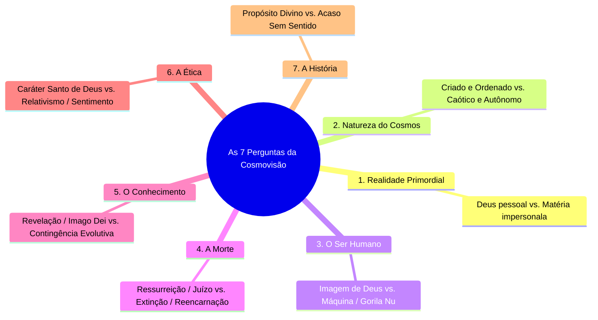

# O Que é uma Cosmovisão? — James W. Sire

Este diretório contém o estudo estruturado e a exposição detalhada do clássico ensaio **"O Que é uma Cosmovisão?"** (*What is a Worldview?*), escrito pelo influente pensador e apologista cristão **Dr. James W. Sire** (extraído e adaptado de sua obra seminal *O Universo ao Lado* / *The Universe Next Door*, Editora Hagnos).

---

## 📌 Visão Geral do Estudo

Mesmo que a maioria das pessoas não possua uma filosofia acadêmica nem uma teologia sistemática formalmente articulada, **todas as pessoas possuem uma cosmovisão**. 

Sempre que pensamos sobre qualquer aspecto da existência — desde uma pergunta cotidiana (*"Onde deixei minhas chaves?"*) até os dilemas mais profundos (*"Quem sou eu?"* ou *"Existe vida após a morte?"*) —, estamos operando a partir de um conjunto de pressuposições fundamentais sobre a realidade.

Uma **cosmovisão** é, em essência:
> *Um conjunto de pressuposições (hipóteses que podem ser verdadeiras, parcialmente verdadeiras ou inteiramente falsas) sustentadas consciente ou inconscientemente, consistente ou inconsistentemente, sobre a constituição básica do nosso mundo.*

---

## 📖 Estrutura dos Capítulos

O estudo foi organizado nos seguintes documentos individuais:

1. [**Capítulo 01: Definição e Natureza de uma Cosmovisão**](file:///f:/ESTUDOS_BIBLICOS/COSMOVISAO_JAMES_SIRE/01_Definicao_e_Natureza_de_uma_Cosmovisao.md)
   - O conceito de pressuposição, o exemplo de Monsieur Jourdain, a metáfora dos óculos e a fundação da Metafísica e Epistemologia.
2. [**Capítulo 02: As Sete Perguntas Fundamentais (Parte 1: Realidade, Homem e Morte)**](file:///f:/ESTUDOS_BIBLICOS/COSMOVISAO_JAMES_SIRE/02_As_Sete_Perguntas_Fundamentais_Parte_1.md)
   - Análise detalhada das 4 primeiras perguntas: Realidade Primordial, O Mundo Exterior, A Natureza Humana e o Destino Pós-Morte.
3. [**Capítulo 03: As Sete Perguntas Fundamentais (Parte 2: Conhecimento, Ética e História)**](file:///f:/ESTUDOS_BIBLICOS/COSMOVISAO_JAMES_SIRE/03_As_Sete_Perguntas_Fundamentais_Parte_2.md)
   - Análise detalhada das 3 perguntas finais: Epistemologia (Como Conhecemos), Ética (Certo e Errado) e Teleologia (O Sentido da História).
4. [**Capítulo 04: Pluralismo, a Ilusão da Neutralidade e a Vida Examinada**](file:///f:/ESTUDOS_BIBLICOS/COSMOVISAO_JAMES_SIRE/04_Pluralismo_Ingenuidade_e_a_Inevitabilidade_da_Cosmovisao.md)
   - O desafio do pluralismo contemporâneo, a impossibilidade da neutralidade filosófica e o imperativo de viver uma vida conscientemente examinada.

---

## 📊 As 7 Perguntas Diagnósticas de James Sire

---

### Resumo Comparativo das Cosmovisões

| Pergunta Diagnóstica | Cosmovisão Cristã (Teísmo) | Naturalismo / Materialismo | Pós-Modernismo / Niilismo |
| :--- | :--- | :--- | :--- |
| **1. Realidade Primordial** | Deus triúno, pessoal e infinito. | A matéria e a energia eterna. | Incerta / Construção de linguagem. |
| **2. O Mundo Exterior** | Criação ordenada por Deus *ex nihilo*. | Sistema fechado de causa e efeito. | Narrativas sociais subjetivas. |
| **3. O Ser Humano** | Criado à imagem e semelhança de Deus. | Produto da evolução biológica. | Construção cultural / Sem essência. |
| **4. A Morte** | Transição para a eternidade (Juízo/Céu). | Extinção da consciência individual. | Cessação irrelevante da existência. |
| **5. Conhecimento** | Possível pela revelação e *Imago Dei*. | Fruto da adaptação evolutiva. | Ilusório / Relativo ao grupo. |
| **6. Certo e Errado** | Ancorado no caráter santo de Deus. | Convenção social ou sobrevivência. | Construção de poder cultural. |
| **7. A História** | Movimento linear em direção à glória de Deus. | Processo cego sem direção moral. | Caos sem meta ou grande narrativa. |

---
*Estudo organizado com base na obra de Dr. James W. Sire (O Universo ao Lado, Ed. Hagnos).*
