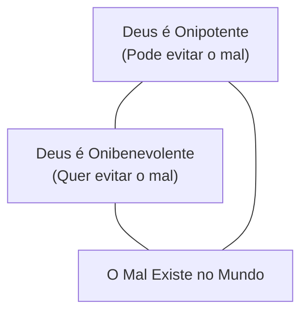

# Capítulo 01: Introdução ao Problema do Mal e à Teodiceia

## 1. O Formidável Desafio da Teodiceia

Entre todos os problemas intelectuais, teológicos e filosóficos que desafiam o teísmo judaico-cristão, nenhum é apontado com maior frequência ou gravidade do que o **Problema do Mal**. 

Thomas Warren ressaltou que nenhuma objeção foi levantada com tanta força crítica contra a fé em um Deus soberano e bom quanto o dilema da existência do mal, da dor e da perversidade no mundo criado.

A questão central da **Teodiceia** (palavra derivada do grego *Theos*, Deus + *Dike*, justiça — ou seja, a "justificação de Deus") é:
> *Como podemos justificar a bondade, a justiça e a perfeição de Deus em um mundo repleto de sofrimento, tragédia e moralidade corrompida?*

---

## 2. A Angústia do Problema na Própria Escritura

O dilema do mal não é apenas uma questão abstrata de filósofos acadêmicos; é uma inquietação sentida e expressa pelos próprios servos de Deus nas Páginas Sagradas:

### A. O Lamento de Habacuque
O profeta Habacuque clama diante da aparente inação divina perante a injustiça:
> *"Tu és tão puro de olhos, que não podes ver o mal e não podes contemplar a perversidade; por que, pois, olhas para os que procedem aleivosamente e te calas quando o ímpio devora aquele que é mais justo do que ele?"* (Habacuque 1:13)

### B. O Questionamento de Gideão
Diante da opressão e da dor enfrentadas por Israel, Gideão ponderou:
> *"Ai, senhor meu, se o Senhor é conosco, por que tudo isso nos sobreveio?"* (Juízes 6:13)

---

## 3. O Trilema Clássico e a Questão Lógica

A filosofia formulou historicamente o problema na forma de um trilema aparente:

Se admitirmos que:
1. Deus tem **poder infinito** para impedir o mal (Onipotência);
2. Deus tem **amor e bondade infinitos** para desejar o fim do mal (Onibenevolente);
3. O mal **realmente existe** e assola a criação;

Os críticos frequentemente concluem que um dos pressupostos teístas deve ser falso. 

---

## 4. O Propósito da Obra de Gordon H. Clark

No livro *Deus e o Mal: O Problema Resolvido* (originalmente publicado como o Capítulo 5 da sua magnum opus *Religion, Reason and Revelation*), o filosofo calvinista **Dr. Gordon H. Clark** demonstra que este trilema só se torna insolúvel quando construído sobre premissas filosóficas pagãs ou teologias equivocadas.

Clark demonstra que o sistema do **Calvinismo bíblico**, condensado na *Confissão de Fé de Westminster*, oferece uma solução **completamente lógica, racional e fiel às Escrituras** para o problema do mal.

---

### Links dos Capítulos:
- ⬅️ [README](file:///f:/ESTUDOS_BIBLICOS/DEUS_E_O_MAL_GORDON_CLARK/README.md)
- ➡️ [Capítulo 02: Refutação das Soluções Não-Cristãs e da Teoria da Privação](file:///f:/ESTUDOS_BIBLICOS/DEUS_E_O_MAL_GORDON_CLARK/02_Solucoes_Nao_Cristas_e_Privacao.md)
