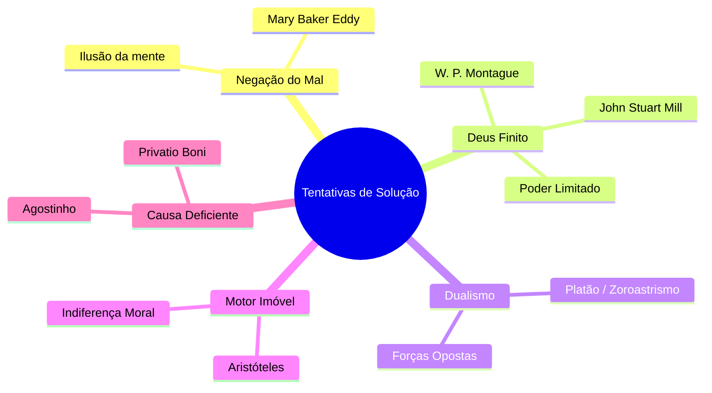

# Capítulo 02: Refutação das Soluções Não-Cristãs e da Teoria da Privação

## 1. As Falhas das Filosofias Não-Cristãs

Ao longo da história, pensadores seculares e de outras religiões tentaram resolver a equação do mal modificando ou eliminando um dos atributos de Deus ou a própria realidade do mal. Gordon H. Clark examina e refuta cada uma dessas posições:

### A. A Negação da Realidade do Mal (Ilusionismo)
* **Proponentes**: Mary Baker Eddy e a Ciência Cristã.
* **Tese**: O mal, a dor e o pecado não existem objetivamente; são apenas ilusões ou erros da mente humana.
* **Refutação Bíblica**: A Escritura afirma categoricamente a realidade do pecado e suas consequências trágicas no mundo (Gênesis 3; Romanos 5:12). Reduzir o sofrimento a uma ilusão é uma negação frontal da realidade do mundo criado.

### B. A Teoria do Deus Finito
* **Proponentes**: John Stuart Mill, William Pepperell Montague.
* **Tese**: Deus é supremamente bom e deseja o bem, mas é limitado em poder ou recursos. Portanto, Ele não pode ser culpado pelo mal, pois faz "o melhor que pode".
* **Refutação Bíblica**: O Deus da Bíblia não é uma deidade impotente. Ele é o Criador *ex nihilo* e Sustentador Todo-Poderoso do universo (Gênesis 1:1; Hebreus 1:1-3; Apocalipse 19:6).

### C. O Dualismo Cósmico
* **Proponentes**: Platão e o Zoroastrismo.
* **Tese**: O Bem e o Mal são dois princípios eternos, independentes e em eterna competição no universo.
* **Refutação Bíblica**: Não existe nenhum poder rival independente de Deus. Deus governa soberanamente sobre todas as coisas e nada resiste ao Seu decreto (Jó 33:13; Isaías 45:5-7).

### D. O Motor Imóvel de Aristóteles
* **Proponentes**: Filosofia aristotélica.
* **Tese**: Deus é uma força distante ("Primeiro Mover Imóvel"), desprovida de interesse pelas questões morais ou sofrimentos das criaturas.
* **Refutação Bíblica**: O Deus verdadeiro se revela pessoalmente na história, importa-se profundamente com a justiça e com o Seu povo (Êxodo 20; João 3:16).

---

## 2. A Teoria Agostiniana da Privação (*Privatio Boni*)

Santo Agostinho de Hipona ofereceu uma das tentativas teológicas mais influentes da história da Igreja:

* **A Tese de Agostinho**:
  Como Deus criou todas as coisas boas, o mal não tem uma substância própria (*ontologia*). O mal é a **ausência ou privação do bem** (*privatio boni*), assim como a escuridão é a mera ausência de luz, ou a ferrugem é a degradação do ferro. O mal é parasita e decorre de uma "causa deficiente" — quando a criatura escolhe um bem menor (sua própria vontade) em vez do Bem Supremo (Deus).

* **A Crítica Severa de Gordon H. Clark**:
  Clark demonstra que a teoria da privação agostiniana não resolve o problema filosófico e teológico:
  > *"Causas deficientes, se é que existem tais coisas, não explicam o porquê um Deus bom e soberano não abole o pecado e garante que os homens sempre escolham o bem mais elevado."* (Clark, p. 9)

Mesmo definindo o mal como uma "ausência de bem", a pergunta fundamental permanece: *Por que Deus decretou ou permitiu que essa ausência do bem ocorresse em um universo governado por Ele?*

---

### Links dos Capítulos:
- ⬅️ [Capítulo 01: Introdução ao Problema do Mal](file:///f:/ESTUDOS_BIBLICOS/DEUS_E_O_MAL_GORDON_CLARK/01_Introducao_ao_Problema_do_Mal.md)
- ➡️ [Capítulo 03: Crítica ao Livre-Arbítrio e ao Arminianismo](file:///f:/ESTUDOS_BIBLICOS/DEUS_E_O_MAL_GORDON_CLARK/03_Critica_ao_Livre_Arbitrio_e_Arminianismo.md)
