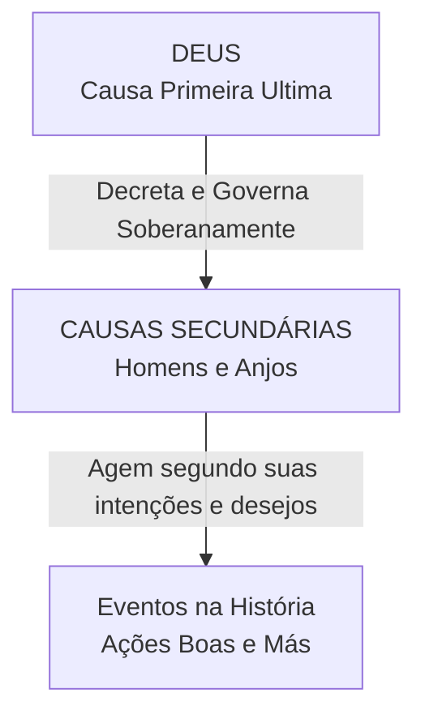

# Capítulo 04: A Doutrina dos Decretos: Causa Primeira vs. Causas Secundárias

## 1. O Ensino da Confissão de Fé de Westminster

Para apresentar uma teodiceia bíblica coerente, Gordon H. Clark apoia-se na teologia reformada clássica expressa na *Confissão de Fé de Westminster* (CFW):

> *"Desde toda a eternidade, Deus, pelo conselho sábio e santo de Sua própria vontade, livre e imutavelmente, ordenou tudo o que venha a ocorrer: ainda assim, nem Deus é o autor do pecado, nem a vontade das criaturas é violentada, nem a liberdade ou contingência das causas secundárias deixa de existir, sendo, ao invés, estabelecida."* (CFW 3:1)

> *"Apesar de que, pela presciência e pelo decreto de Deus – a primeira causa –, todas as coisas venham a ocorrer de modo imutável e infalível; ainda assim, pela mesma providência, Ele ordena que elas aconteçam de acordo com a natureza das causas secundárias..."* (CFW 5:2)

---

## 2. A Distinção entre Causa Primeira e Causa Secundária

A chave para entender a soberania divina sem transformar Deus no autor do pecado é a distinção bíblica entre a **Causa Primeira** e as **Causas Secundárias**:

1. **Deus é a Causa Primeira de Tudo**: Nada ocorre no universo sem o decreto soberano de Deus. Ele decreta o fim e também decreta os meios pelos quais esse fim será atingido.
2. **As Criaturas são Causas Secundárias**: Deus realiza Seus decretos através de agentes criados (homens e anjos), que agem de acordo com a sua própria natureza moral e motivações internas.

Deus não dispõe as coisas nem controla a história à parte das causas secundárias. **Deus decreta que o fim será realizado por meio dos meios.**

---

## 3. Livre Agência Moral vs. Liberdade de Indiferença

A Teologia Reformada e Gordon H. Clark distinguem claramente dois conceitos de "liberdade":

| Conceito | Definição | Posição Reformada |
| :--- | :--- | :--- |
| **Liberdade de Indiferença** | A capacidade teórica da vontade de escolher sem ser determinada por nenhum fator interno (natureza, desejos) ou externo (decreto). | **FALSA e Impossível**. O homem nunca escolhe de forma neutra ou indiferente. |
| **Livre Agência Moral** | A capacidade da criatura de escolher e agir voluntariamente segundo seus próprios desejos, intenções e impulsos sem coerção externa. | **VERDADEIRA**. Todos os homens possuem livre agência moral. |

### A Condição do Homem Caído (Depravação Total)
* **Adão antes da Queda**: Tinha livre agência moral e a capacidade de escolher o bem que agradava a Deus (*posse non peccare*).
* **O Homem Caído**: Mantém sua livre agência moral (ele sempre escolhe o que deseja), mas sua natureza moral está totalmente corrompida pelo pecado (*non posse non peccare*). Por isso, suas escolhas espontâneas são sempre voltadas para a rebeldia contra Deus (Romanos 3:9-18; 8:7-8).
* **O Homem Regenerado**: Pela graça do Espírito Santo, a capacidade de escolher o bem espiritual é restaurada.

---

## 4. Por que a Pecaminosidade Pertence Apenas à Criatura?

Deus é a **Causa Primeira soberana** de cada evento (inclusive do ato pecaminoso), mas a **pecaminosidade da ação pertence exclusivamente à Causa Secundária** (a criatura).

Como explica Clark:
* Apenas as causas secundárias possuem motivações rebeldes, maus hábitos e intenções pecaminosas.
* Deus decreta o ato para um propósito santo, justo e sábio; a criatura executa o ato por um motivo perverso e egoísta.
* Portanto, a responsabilidade moral recai sobre quem praticou o pecado motivado por sua própria corrupção.

---

### Links dos Capítulos:
- ⬅️ [Capítulo 03: Crítica ao Livre-Arbítrio e ao Arminianismo](file:///f:/ESTUDOS_BIBLICOS/DEUS_E_O_MAL_GORDON_CLARK/03_Critica_ao_Livre_Arbitrio_e_Arminianismo.md)
- ➡️ [Capítulo 05: Vontade Decretiva vs. Vontade Preceptiva](file:///f:/ESTUDOS_BIBLICOS/DEUS_E_O_MAL_GORDON_CLARK/05_Vontade_Decretiva_vs_Preceptiva.md)
