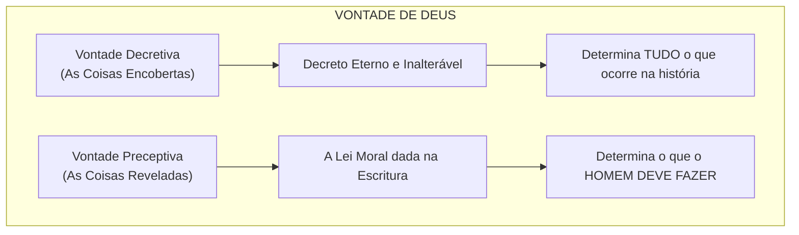

# Capítulo 05: Vontade Decretiva vs. Vontade Preceptiva

## 1. O Fundamento Exegetico em Deuteronômio 29:29

Para compreender como Deus decreta eventos que envolvem pecado sem violar a Sua própria santidade, é indispensável compreender a distinção bíblica das duas dimensões da vontade de Deus:

> *"As coisas encobertas pertencem ao Senhor nosso Deus, mas as reveladas nos pertencem a nós e a nossos filhos para sempre, para que observemos todas as palavras desta lei."* (Deuteronômio 29:29)

Moisés estabeleceu aqui a fronteira teológica fundamental entre a **Vontade Decretiva** e a **Vontade Preceptiva**:

---

## 2. A Comparação das Duas Vontades

| Característica | Vontade Decretiva (Soberana/Secreta) | Vontade Preceptiva (Revelada/Moral) |
| :--- | :--- | :--- |
| **Definição** | O conselho eterno de Deus determinando tudo o que acontecerá. | O padrão de conduta e mandamentos revelados aos homens. |
| **Pode ser violada?** | **IMPOSSÍVEL**. Ninguém pode resistir ou frustrar o decreto de Deus (Jó 42:2; Daniel 4:35). | **SIM**. O homem viola a Vontade Preceptiva sempre que peca. |
| **Finalidade** | Revelar a providência, o plano soberano e a glória de Deus. | Estabelecer o dever moral da criatura responsável. |

---

## 3. O Problema da Intenção: Como Deus Pode Desejar o que Proíbe?

Muitos perguntam: *"Se assassinar é pecado e contra a vontade de Deus, como pode Deus ter decretado que o assassinato de Cristo ocorresse?"*

Gordon H. Clark responde apontando que não há contradição lógica quando distinguimos os dois sentidos da palavra "vontade":

1. O assassinato viola a **Vontade Preceptiva** de Deus ("Não matarás"). Os pecadores violaram a lei moral e por isso são moralmente culpados.
2. Contudo, o evento da morte de Cristo cumpriu com precisão milimétrica a **Vontade Decretiva** de Deus para a redenção da humanidade (Atos 4:27-28).

O homem é responsável e julgado pela sua desobediência à **Vontade Preceptiva** (a Lei que lhe foi dada para obedecer), e não pela Vontade Decretiva de Deus (que pertence exclusivamente ao Senhor).

---

## 4. O Estudo de Caso de José do Egito

Outro exemplo bíblico clássico é a história de José e seus irmãos:

* **O Ato Pecaminoso**: Os irmãos de José o odiaram, conspiraram para matá-lo e o venderam como escravo para o Egito. Violaram frontalmente a Vontade Preceptiva de Deus.
* **O Decreto Divino**: Anos mais tarde, José declarou sob inspiração:
  > *"Vós bem intentastes mal contra mim; porém Deus o intentou para bem, para fazer como se vê neste dia, para conservar muita gente com vida."* (Gênesis 50:20)

Deus e os irmãos de José pretendiam o mesmo evento físico (a ida de José ao Egito), mas com motivações e intenções opostas:
* Os irmãos intentaram o mal (causa secundária pecaminosa).
* Deus intentou o bem soberano (causa primeira santa e sábia).

---

### Links dos Capítulos:
- ⬅️ [Capítulo 04: A Doutrina dos Decretos: Causa Primeira vs. Causas Secundárias](file:///f:/ESTUDOS_BIBLICOS/DEUS_E_O_MAL_GORDON_CLARK/04_Causa_Primeira_e_Causas_Secundarias.md)
- ➡️ [Capítulo 06: Deus Acima da Lei (*Ex-Lex*) e a Responsabilidade Humana](file:///f:/ESTUDOS_BIBLICOS/DEUS_E_O_MAL_GORDON_CLARK/06_Deus_Ex_Lex_e_Responsabilidade_Humana.md)
