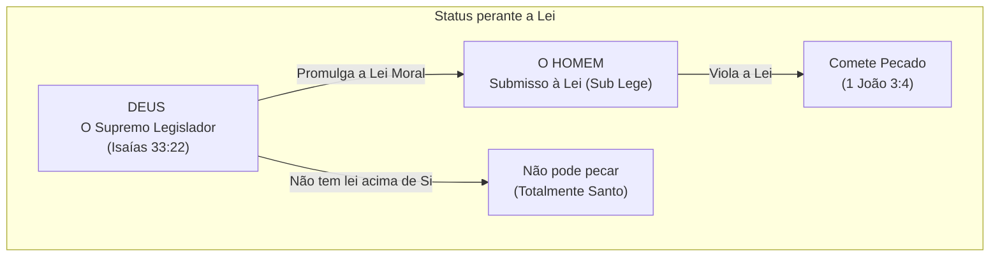

# Capítulo 06: Deus Acima da Lei (*Ex-Lex*) e a Responsabilidade Humana

## 1. A Definição Bíblica de Pecado

Para responder conclusivamente se Deus pode ser "autor do pecado" ao decretar o mal, Gordon H. Clark exige que partamos da própria definição bíblica de pecado:

> *"Qualquer que comete o pecado, também comete iniquidade; porque o pecado é a transgressão da lei."* (1 João 3:4)

Conforme a Escritura:
* O pecado não é uma substância metafísica;
* O pecado é um **ato de desobediência a uma lei imposta a um sujeito sob autoridade**.

---

## 2. O Conceito Teológico de *Ex-Lex*

A pergunta decisiva é: *Deus está sujeito à lei moral?*

A resposta de Clark é categórica: **Não. Deus é *Ex-Lex* (acima da lei).**

### Argumentos Teológicos de Clark:
1. **Deus é o Criador e Único Legislador**: Os Dez Mandamentos foram promulgados como obrigações para o homem, não para Deus (Isaías 33:22; Tiago 4:12).
2. **Deus não presta contas a ninguém**: *"Porque não dará contas de nenhum dos seus atos"* (Jó 33:13).
3. **Deus não pode violar uma lei que não se aplica a Ele**: Como o pecado é a transgressão da lei por um subordinado, e Deus não é subordinado a nenhuma lei externa ou superior, **Deus nunca peca nem pode pecar**.

---

## 3. O que Torna o Homem Responsável?

Se Deus determina soberanamente todas as coisas (incluindo as ações humanas), o que torna o homem responsável por seus pecados?

A visão popular errônea sugere que a responsabilidade exige "livre-arbítrio libertário". Clark refuta essa ideia e demonstra que a **única pré-condição necessária e suficiente para a responsabilidade é a existência de um Legislador e Juiz Supremo com autoridade para punir**:

> *"O homem é responsável porque Deus o chama para prestar contas; o homem é responsável porque o poder supremo pode puni-lo por desobediência."* (Clark, p. 54)

### A Justiça Absoluta da *Ipsa Voluntas* Divina
O reformador Jerônimo Zanchius, citado com aprovação por Clark, sintetizou a soberania da vontade de Deus:

> *"A vontade de Deus é de tal modo a causa de todas as coisas, quanto ela própria não tem causa, uma vez que não há nada que possa ser a causa daquilo que causa todas as coisas. Assim, nós encontramos todo assunto resolvido, em última instância, na simples satisfação soberana de Deus. Ele não tem outro motivo para aquilo que faz, além da ipsam voluntatem, sua mera vontade — vontade esta tão longe de ser injusta, que ela é a própria justiça."* (Zanchius, cit. em Clark)

Tudo o que Deus faz ou decreta é **moralmente certo e justo simplesmente porque é Deus quem o decreta**. Deus é o padrão supremo e absoluto de justiça.

---

### Links dos Capítulos:
- ⬅️ [Capítulo 05: Vontade Decretiva vs. Vontade Preceptiva](file:///f:/ESTUDOS_BIBLICOS/DEUS_E_O_MAL_GORDON_CLARK/05_Vontade_Decretiva_vs_Preceptiva.md)
- ➡️ [Capítulo 07: Determinismo Bíblico vs. Fatalismo e a Glória de Deus](file:///f:/ESTUDOS_BIBLICOS/DEUS_E_O_MAL_GORDON_CLARK/07_Determinismo_Biblico_e_Gloria_de_Deus.md)
