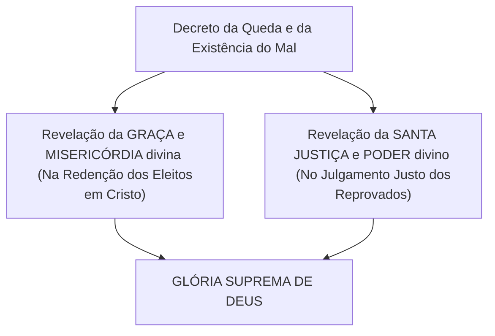

# Capítulo 07: Determinismo Bíblico vs. Fatalismo e a Glória de Deus

## 1. Determinismo Bíblico não é Fatalismo

Muitos críticos acusam o determinismo calvinista de Clark de ser um mero "fatalismo pagão" (como o estoicismo ou o determinismo mecanicista). Clark refuta essa acusação mostrando a diferença abissal entre as duas visões:

| Característica | Fatalismo Pagão | Determinismo Bíblico / Calvinista |
| :--- | :--- | :--- |
| **Agente Supremo** | Um Destino cego, impessoal ou deuses caprichosos. | O Deus pessoal, infinito em sabedoria, justiça e amor. |
| **O Homem na História** | O homem é totalmente passivo; seus desejos e escolhas não importam. | O homem é um agente moral ativo cujas escolhas reais são as causas secundárias decretadas. |
| **O Uso dos Meios** | "Se é meu destino me curar, não preciso ir ao médico." | Deus decreta a cura **por meio** da ida ao médico e do uso do remédio. |
| **Responsabilidade** | O homem é irresponsável por ser mero fantoche do destino. | O homem é plenamente responsável por suas motivações morais voluntárias. |

---

## 2. A Solução Axiomática Epistemológica

Gordon H. Clark enfatiza que o problema do mal só é resolvido quando adotamos a **epistemologia pressuposicionalista bíblica**:

Se partirmos de filosofias humanas baseadas na autonomia da razão ou na autonomia do livre-arbítrio, o problema do mal será um labirinto sem saída. 

Porém, quando permanecemos no fundamento sólido da Escritura (Mateus 7:24-25), compreendemos que:
1. Deus é Santo e incapaz de errar (Isaías 6:3; Tiago 1:13).
2. Deus decreta soberanamente a ocorrência de episódios maus e pecaminosos para Seus próprios propósitos sábios e santos (Isaías 45:7; Provérbios 16:4).
3. E precisamente porque Deus os decretou, esses decretos são bons e corretos em relação ao propósito final divino.

---

## 3. O Objetivo Supremo: A Glória de Deus

Por que Deus decretou a existência do mal e a Queda da humanidade em vez de criar um mundo onde o pecado jamais entrasse?

A resposta bíblica final sintetizada por Clark e pela Confissão de Fé de Westminster é:
> **Deus decretou a existência do mal para o cumprimento do Seu objetivo soberano e supremo: a revelação plena da Sua Glória.**

Se o pecado jamais tivesse entrado no mundo:
* A profundidade insondável da **Graça e Misericórdia de Deus** manifestada na Cruz de Jesus Cristo jamais seria conhecida pelas criaturas;
* A **Santidade e a Justiça Punitiva** de Deus contra a rebeldia nunca seriam demonstradas em toda a sua plenitude.

Portanto, como conclui a análise de Clark:
> *"É bom, então, que o pecado exista. Deus o decretou e ele [o pecado] está trabalhando para o objetivo final: a glória de Deus."* (Crampton, p. 7)

---

## 📚 Conclusão Geral do Estudo

A obra *Deus e o Mal: O Problema Resolvido* de Gordon H. Clark permanece como um monumento de rigor lógico e fidelidade teológica. Ela liberta o cristão do medo das objeções céticas, ancorando a fé na soberania inabalável do Deus da Bíblia — Aquele que reina sobre o bem e o mal, guiando a história infalivelmente para o triunfo da Sua glória eterna.

---

### Links dos Capítulos:
- ⬅️ [Capítulo 06: Deus Acima da Lei (*Ex-Lex*) e a Responsabilidade Humana](file:///f:/ESTUDOS_BIBLICOS/DEUS_E_O_MAL_GORDON_CLARK/06_Deus_Ex_Lex_e_Responsabilidade_Humana.md)
- 🏠 [Voltar ao README Principal](file:///f:/ESTUDOS_BIBLICOS/DEUS_E_O_MAL_GORDON_CLARK/README.md)
