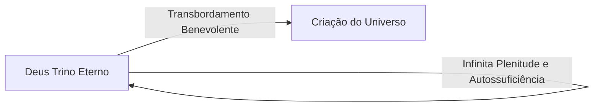

# 01. Introdução e Distinções Conceituais

Nesta introdução de sua dissertação, Jonathan Edwards estabelece a fundação lógica e terminológica indispensável para investigar qual o fim supremo para o qual Deus criou o universo. Edwards adverte que a ambiguidade de linguagem tem gerado grandes confusões na teologia e na filosofia.

---

## 🔑 Distinções Terminológicas Fundamentais

Edwards distingue quatro pares de termos para analisar as ações de um agente inteligente:

### 1. Fim Principal vs. Fim Inferior
* **Fim Principal:** É aquele objetivo que o agente valoriza em grau supremo.
* **Fim Inferior:** É um objetivo secundário, valorizado em grau menor.
* *Nota:* Um fim principal é sempre um fim último, mas nem todo fim último é necessariamente um fim principal.

### 2. Fim Último vs. Fim Subordinado
* **Fim Subordinado:** É algo desejado não por sua própria causa, mas puramente como um meio para alcançar um objetivo posterior (ex.: comprar ferramentas de cultivo como meio para cultivar a terra).
* **Fim Último:** É aquilo que é buscado por sua própria causa, tendo valor intrínseco para o agente, e não como simples degrau para outra finalidade.

### 3. Fim Último Original e Independente vs. Fim Último Consequente
* **Fim Último Original:** Aquilo que moveu o agente a agir antes de existir qualquer consideração sobre estados contingentes futuros.
* **Fim Último Consequente:** Um objetivo que surge em decorrência de eventos intermediários ou atitudes das criaturas.

---

## 🏛️ A Autossuficiência Absoluta do Criador

Jonathan Edwards enfatiza que qualquer investigação teológica sobre a criação deve partir da premissa inegociável da **plenitude e autossuficiência de Deus**:

1. Deus existia eternamente em absoluta e infinita perfeição antes da criação.
2. A criação não adicionou nada à essencial plenitude, poder, sabedoria ou glória interior de Deus.
3. Portanto, Deus não criou o mundo por necessidade, falta, carência ou para adquirir algo que Lhe faltava.

---

## 💡 Princípios para a Investigação

Ao investigar o fim da criação, Edwards conclui a introdução estabelecendo duas balizas:
* De um lado, a **Razão Humana** alinhada aos primeiros princípios morais e metafísicos.
* De outro lado, a **Revelação Bíblica**, que possui a palavra final e definitiva sobre a mente do Criador.

 nas próximas seções, Edwards testará como a razão pura e as Sagradas Escrituras convergem de maneira harmoniosa para a mesma resposta teocêntrica.
