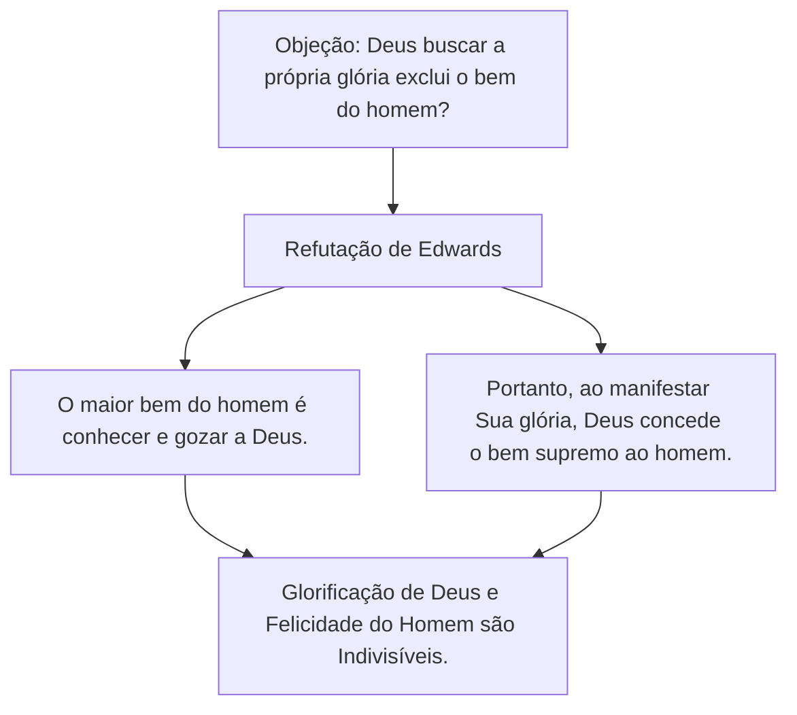

# 02. O Que Ensina a Razão (Capítulo I)

No primeiro capítulo de sua dissertação, Jonathan Edwards examina o que a razão humana, fundamentada em princípios morais e metafísicos universais, dita em relação ao propósito de Deus na criação do mundo.

---

## ⚖️ Seção 1: Algumas Coisas Observadas em Geral pela Razão

Edwards argumenta a partir da natureza do Ser e do Valor:

1. **A Proporção do Valor Real:** A razão nos ensina que um ser deve ser valorizado de acordo com o seu valor real intrínseco.
2. **Infinitude vs. Finitude:** Deus é o Ser Infinito, a soma de toda a realidade, beleza e perfeição. Todas as criaturas juntas, em comparação com Deus, são menos que uma gota de água no oceano ou um grão de poeira na balança.
3. **A Suprema Estimativa Divina:** Portanto, seria moralmente impróprio e injusto se Deus valorizasse a criação finita acima de Si mesmo. A razão exige que Deus tenha por Si mesmo uma consideração suprema e infinita.

---

## 🌊 Seção 2: O que a Razão nos Leva a Supor que Deus Visava na Criação

A razão conclui que o fim de Deus na criação foi a **comunicação da Sua infinita plenitude**:

* Deus possui em Si mesmo infinita sabedoria, santidade, poder e alegria.
* É próprio da infinita bondade desejar que essa plenitude se expanda e seja comunicada a entendimentos e corações criados.
* Ao emanar Sua plenitude, Deus busca:
  1. Que Sua glória e perfeição sejam **conhecidas** (conhecimento/verdade).
  2. Que Sua glória e perfeição sejam **amadas e estimadas** (santidade/virtude).
  3. Que Sua glória e perfeição sejam **desfrutadas** (felicidade/alegria).

---

## ☀️ Seção 3: Consideração Suprema por Si Mesmo na Emanação

Edwards explica que, ao comunicar Sua plenitude à criatura, Deus continua fazendo de Si mesmo o Seu fim supremo:

> A emanação da glória de Deus não é uma perda ou alienação de Si mesmo, mas a expansão e o refulgir de Sua própria excelência. 

Quando a criatura contempla a beleza de Deus, ama a Deus e se alegra em Deus, o objeto e o motivo de todo esse processo continua sendo a própria excelência de Deus refletida no espelho da criação.

---

## 🛡️ Seção 4: Objeções Consideradas e Respondidas

Edwards antecipa e refuta com maestria as principais objeções filosóficas:

### Objeção 1: "Deus buscar a própria glória não seria egoísmo ou vaidade?"
* **Resposta de Edwards:** O egoísmo humano é imperfeito e pecaminoso porque o homem busca usurpar o valor que pertence a Deus e retira o bem do próximo para si. Mas Deus é a fonte de todo o valor e bem. Ao buscar a Si mesmo, Deus busca a Suprema Perfeição. Deus não 'ganha' nada das criaturas; pelo contrário, Ele glorifica a Si mesmo **dando-se** às criaturas.

### Objeção 2: "Deus não criou o mundo puramente por amor à criatura?"
* **Resposta de Edwards:** O amor de Deus pelas criaturas e Seu amor por Si mesmo não são concorrentes. O bem supremo da criatura é ter o próprio Deus como sua porção. Deus ama as criaturas promovendo o maior bem delas, que é o conhecimento e o gozo d'Ele mesmo.

