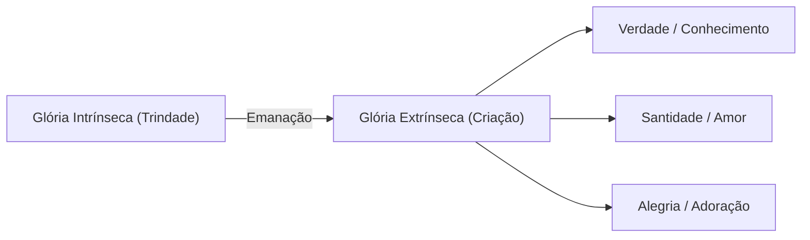

# 04. A Comunicação do Bem e o Significado da Glória (Capítulo II, Seções 5–6)

Nas seções 5 e 6 do Capítulo II, Jonathan Edwards aborda o papel da felicidade humana no plano de Deus e faz uma profunda investigação linguística e exegética dos conceitos bíblicos de *Glória* e *Nome*.

---

## 🎁 Seção 5: A Comunicação do Bem à Criatura como Fim em Vista

Edwards demonstra que as Escrituras afirmam claramente que Deus se importa com a criatura e planejou a comunicação de bênçãos e felicidade como um fim em Sua criação:

1. **Benevolência Divina:** Deus se deleita em fazer o bem às Suas criaturas e em conceder-lhes salvação, vida eterna e gozo inefável.
2. **Subordinação Harmoniosa:** No entanto, a Escritura jamais apresenta o bem da criatura como um fim supremo *independente* ou *competidor* com a glória de Deus.
3. O bem da criatura é um fim que está **incluído e subordinado** ao fim último, que é a glorificação de Deus.

---

## 🔍 Seção 6: Análise Linguística dos Termos "Glória" e "Nome"

Edwards analisa as palavras bíblicas originais para "Glória":

### No Antigo Testamento: *Kabod* (כָּבוֹד)
* Significado literal: "Peso", "pesadez", "relevância", "riqueza" ou "esplendor".
* Usado para descrever a dignidade suprema, a majestade visível de Deus e o peso intrínseco de Sua excelência moral e divina.

### No Novo Testamento: *Doxa* (δόξα)
* Significado: "Opinião excelente", "renome", "honra", "brilho", "luz radiante".
* Refere-se tanto à excelência interior de Deus quanto ao reconhecimento e louvor que Lhe são devidos.

### A Relação entre Glória e Nome
* Em passagens como Jeremias 14:21 e Salmo 74:7, o **Nome de Deus** e a **Glória de Deus** são usados como sinônimos intercambiáveis.
* O "Nome" de Deus é a manifestação exterior daquilo que Deus é em Sua glória interior.

---

## 💎 As Duas Dimensões da Glória de Deus

Edwards sintetiza o significado bíblico de "Glória" em duas facetas inseparáveis:

1. **Glória Intrínseca (Interior):** A plenitude perfeita das virtudes, conhecimento, santidade e felicidade de Deus na Trindade.
2. **Glória Extrínseca (Exterior):** A emanação e reflexo dessa plenitude na criação. Consiste em:
   * **Entendimento Criado:** Conhecimento claro da verdade de Deus.
   * **Vontade Criada:** Amor supremo e santidade em conformidade com Deus.
   * **Afeto/Expressão:** Alegria radiante, gratidão e adoração vocal a Deus.

