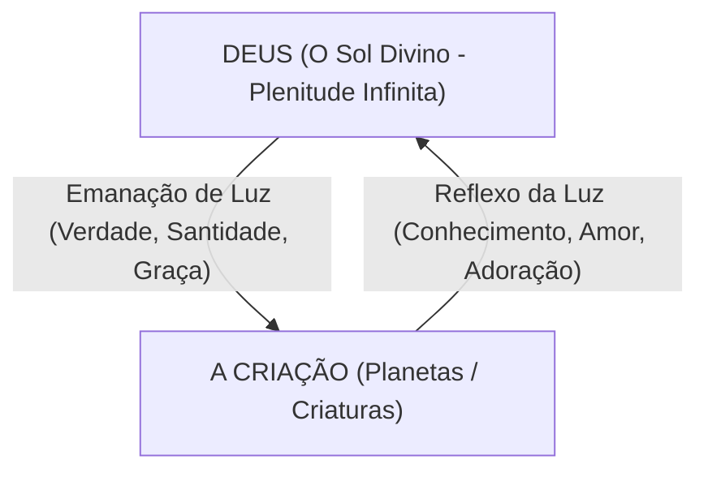

# 05. O Fim da Criação é Apenas UM (Capítulo II, Seção 7 - Síntese)

A sétima e última seção do Capítulo II representa o ápice filosófico e teológico de toda a obra de Jonathan Edwards. Aqui, ele une todas as pontas soltas da dissertação em uma única e majestosa síntese.

---

## 🌟 O Fim Supremo é ÚNICO

Edwards demonstra que, embora a Bíblia use termos variados (glória de Deus, nome de Deus, louvor, bem das criaturas, manifestação da sabedoria), **o propósito de Deus na criação não é múltiplo ou dividido, mas UM SÓ**.

> Todas as diversas expressões bíblicas referem-se a diferentes aspectos de uma única e soberana realidade: a emanação e o refulgir da plenitude divina (*emanation and refulgence of God's fullness*).

---

## ☀️ A Analogia do Sol e da Luz

Edwards utiliza uma célebre analogia astronômica para ilustrar essa grande verdade:

* **O Sol (Deus):** Possui em si mesmo uma plenitude incalculável de luz e calor (Glória Intrínseca).
* **A Luz Radiante (Emanação):** A luz que sai do Sol ilumina os planetas e seres no espaço.
* **O Reflexo da Luz (Adoração):** A luz captada pelos corpos celestes reflete o próprio brilho do Sol de volta à sua origem.

Neste ciclo contínuo, a luz recebida pela criatura **é a mesma luz** que glorifica o Sol. Portanto, a bênção recebida pela criatura e a glória dada ao Criador são inseparáveis.

---

## 🔄 Reconciliação entre Teocentrismo e Felicidade Humana

A maior contribuição de Edwards nesta seção é demonstrar que não há qualquer conflito entre buscar a glória de Deus e buscar a felicidade da criatura:

1. **A Natureza da Felicidade da Criatura:** A verdadeira felicidade do homem não consiste em prazeres terrenos ou no egoísmo autônomo, mas em:
   * Contemplar a beleza de Deus.
   * Estimar e amar a Deus supremamente.
   * Regozijar-se na glória de Deus.
2. **Deus Glorificado no Nosso Prazer d'Ele:** Quando a criatura encontra sua satisfação máxima em Deus, a criatura é supremamente abençoada e Deus é supremamente glorificado.

---

## 🚀 A União Eterna e a Progressão Infinita

Edwards encerra a obra apontando para a eternidade futura:

* A união entre a criatura redimida em Cristo e o Criador não é estática, mas dinâmica.
* Como Deus é infinitamente elevado, a criatura criada continuará aumentando em conhecimento, amor e alegria em Deus por toda a eternidade.
* É uma progressão eterna em direção à infinitude divina:

$$\text{Progresso da Criatura} \longrightarrow \infty \text{ (Tendo a Glória Divina como Alvo Eterno)}$$

---

## 📌 Conclusão da Obra

Com esta obra, Jonathan Edwards estabeleceu um dos pilares mais sólidos do pensamento cristão reformado:

> **"Deus é o Alfa e o Ômega, o Princípio, o Meio e o Fim de todas as coisas. Ao fazer de Si mesmo o Seu fim último na criação, Deus manifesta o ápice da justiça, da sabedoria e do amor infinito."**
